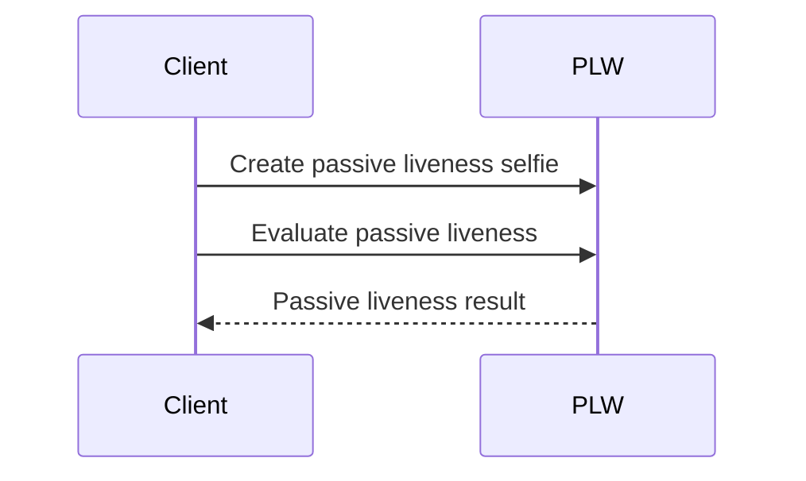

# Passive Liveness Webservice Integration Samples

## Available Samples
1. [Evaluate Passive Liveness](#evaluate-passive-liveness)

## Build and Run
You can use attached Gradle wrapper for build and run of samples.
Build task will also create and build API client files from attached `plw-swagger.yml`.

For project build run:
```shell
./gradlew clean build
```

Application can be configured by modifying properties in file `./src/main/resources/application.properties`.  
Mostly you will use:
```properties
dot-passive-liveness-service-url=url_address_of_running_dot_passive_liveness_service
example-base64-encoded-image=Base64_encoded_image_to_use_in_samples
```

## Passive Liveness Evaluation Samples
#### Evaluate Passive Liveness

This sample sends detection request for image under `example-base64-encoded-image` and evaluates score for [passive liveness detection](https://developers.innovatrics.com/digital-onboarding/docs/functionalities/face/passive-liveness-check/).


